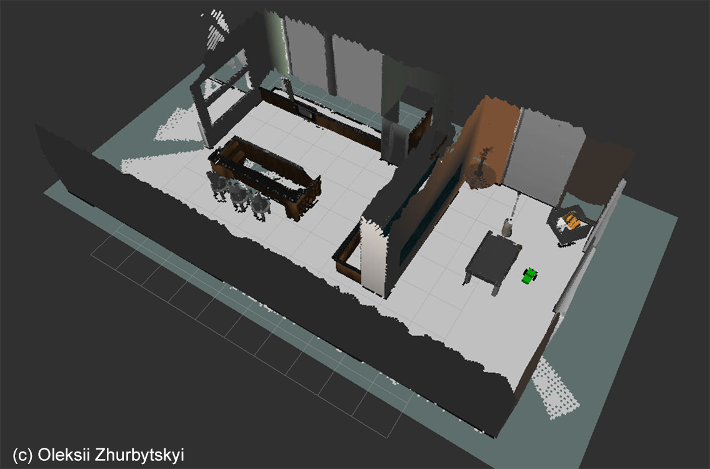

# Map My World Robot
Udacity Robotics Nanodegree project.

The goal of the project is to create a 2D occupancy grid and 3D octomap from a provided simulated environment.


## Requirements
1. Install depthimage_to_laserscan.
```
apt-get update && apt-get install ros-kinetic-depthimage-to-laserscan
```

2. Add the `rtabmap_ros` package.
```
cd ~/catkin_ws/src && git clone https://github.com/introlab/rtabmap_ros
```

## How To Use

1. Launch the gazebo world and the robot.
```
roslaunch slam_project world.launch world_file:=~/catkin_ws/src/slam_project/worlds/kitchen_dining.world
```

2. Launch teleop node.
```
roslaunch slam_project teleop.launch
```

3. Launch mapping node.
```
roslaunch slam_project mapping.launch
```

4. Launch Rviz.
```
roslaunch slam_project rviz.launch
```
